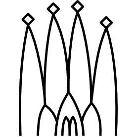
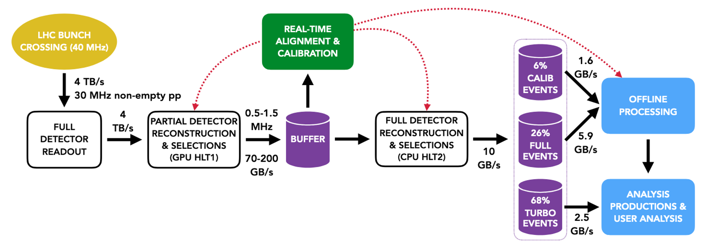
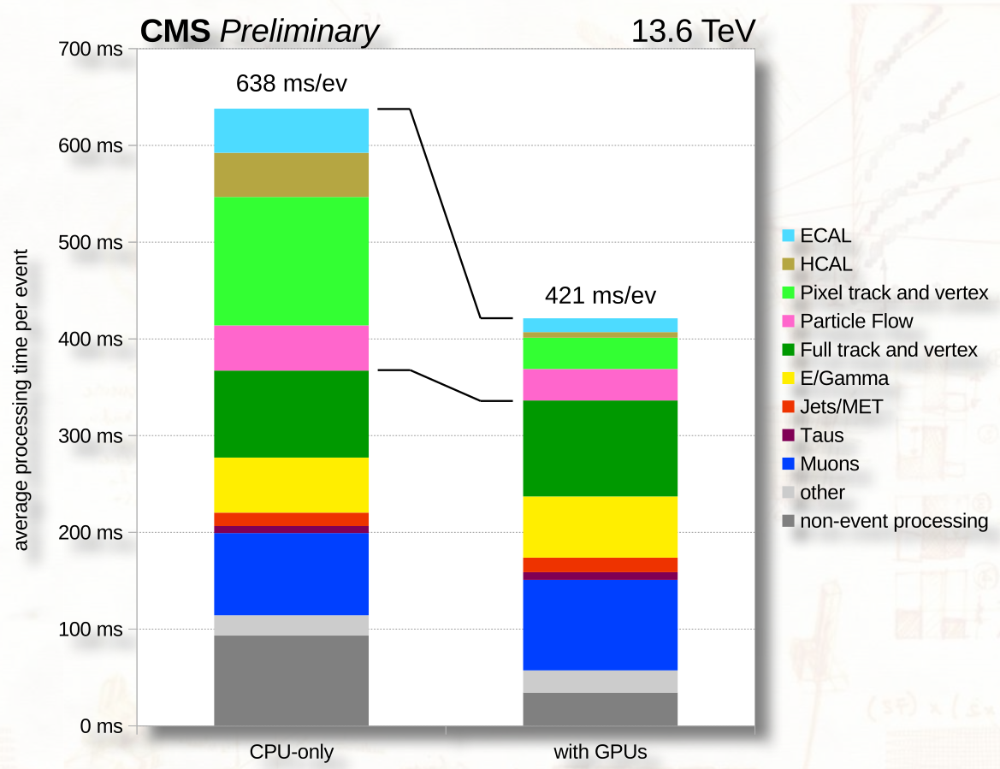
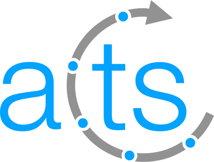
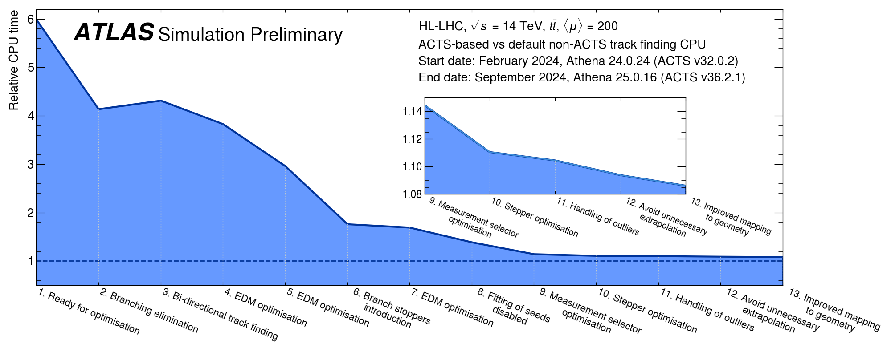
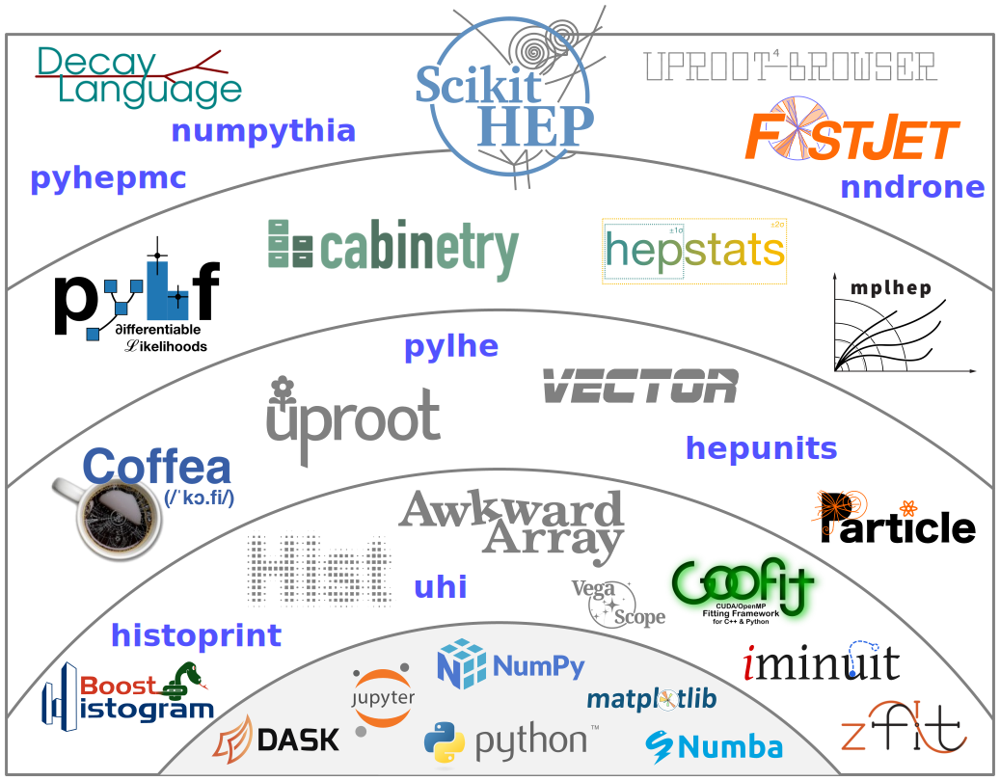
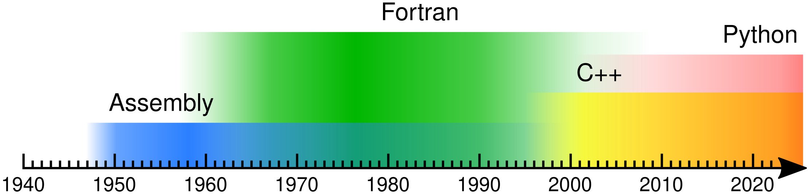

class: middle, center, title-slide
count: false

# The HEP Software Ecosystem

.huge.blue[Matthew Feickert] 
.huge[(University of Wisconsin-Madison)]

.large[
[APS Global Physics Summit](https://summit.aps.org/events/APR-P88/2) 
Advances in Computing in High Energy Physics Mini-Symposium 
March 18th, 2026
]

<!--
# Abstract

Particle physics relies on an expansive ecosystem of software tools to accomplish all aspects of the work needed to deliver physics results.
These range from tools required for the acquisition and handling of data in experiments, to pattern recognition and feature extraction (both in real time and in offline processing), to sophisticated analysis techniques.
These are complemented by tools for simulation of both the underlying physics and the interactions of particles in detectors, as well as tools to support data and workflow management.
Further software tools support the larger information system for particle physics needed to interpret and combine results across the global scientific community.

Components of this ecosystem have their own software lifecycle, though tools may live and evolve for decades, encapsulating significant intellectual effort and products from the HEP community with substantial physics impact.
This talk will review the global HEP software ecosystem and discuss how it is used in running experiments today, as well as how planned experiments are already building on, and contributing to, the foundation provided by the ecosystem to deliver scientific progress in particle physics in the coming decade and beyond.
-->

---
# Overview

.kol-3-5[
.larger[
* Robust and performant software is .bold[critical] to the high energy physics community
* Reflect on the scope of the HEP software community
   - Current software
   - Ongoing work to support experiments
   - Community support for future experiment software ecosystems
* We'll start by following the data generating physics processes to cover the breadth
]
]
.kol-2-5.center.large[

   <figure>
      
      
      <figcaption>Experiments given software community <b>new challenges and opportunities</b>. Projected required compute usage for HL-LHC  (want R&D below budget line)</figcaption>
   </figure>

]

---
# Simulation

.kol-2-5[
.code-large[
* Excellent fidelity simulation is .bold[critical] for all other components of physics
* .bold[Physics event generator]: Hard process, showering, hadronization, decay
   - MadGraph5_aMC@NLO, Pythia, Sherpa, Herwig, EvtGen
* .bold[Detector simulation] with [Geant4](https://cern.ch/geant4)
* .bold[Fast simulation] approaches to decrease CPU
   - Parametric: Delphes
   - ML-based surrogates: [FlashSim](https://cds.cern.ch/record/2858890)
   - Combination: AtlFast3
]
]
.kol-3-5[
$$
p\left(x \middle|\theta\right) = \int dz\_{D} dz\_{S} dz\_{P} \\, p\left(x \middle|z\_{D}\right) p\left(z\_{D} \middle|z\_{S}\right) p\left(z\_{S} \middle|z\_{P}\right) p\left(z\_{P} \middle|\theta\right)
$$

   

<!-- TODO: Fix figure -->
]

???
Simulation is essential for interpreting experimental results, and it consumes roughly half of the global HEP computing budget. The chain starts with physics event generators — MadGraph and Sherpa for hard processes, Pythia and Herwig for parton showering and hadronization — and continues through Geant4 for detailed detector response simulation. Because full Geant4 simulation is so expensive, the community is actively pursuing fast simulation alternatives: parametric approaches like AtlFast and Delphes, and increasingly ML-based surrogates like CaloFlow for calorimeter simulation. The HSF Generator Working Group coordinates community-wide efforts to improve generator software efficiency, which is critical for the HL-LHC era.

---
# Data Acquisition & Trigger

.kol-1-2[
.code-large[
* Trigger systems bring event rates from data source to manageable levels for readout
   - At LHC: 40 MHz beam crossing to $O$(10 MHz)
* In LHC experiments see exploitation of .bold[heterogeneous computing] in trigger to increase computing power
   - ATLAS: [AthenaMT](https://atlas.cern/updates/briefing/renovating-athena) (multithreaded framework)
   <!-- https://indico.cern.ch/event/1361472/contributions/5972904/ -->
   - CMS: GPU-accelerated reconstruction in HLT with Pixel, HCAL, ECAL code running on CUDA-enabled GPUs using &nbsp;
   - LHCb: Allen &mdash; Fully GPU-based HLT1  ([Comput Softw Big Sci 4, 7 (2020)](https://doi.org/10.1007/s41781-020-00039-7))
<!-- TODO: Explain what Gaudi is -->
* ATLAS and LHCb both build on the [GAUDI](https://inspirehep.net/literature/568472) event data processing framework &nbsp;
<!-- https://indico.cern.ch/event/1291023/contributions/5866459/ -->
<!-- TODO: Explain what software systems -->
* DUNE TDAQ (data reduction of $O(10^4)$)
]
]
.kol-1-2.center[

<figure>
   
   <figcaption>LHCb's "Allen" GPU HLT1 and "Moore" CPU HLT2 with the Moore software bring trigger rate to 30 MHz</figcaption>
</figure>
<figure style="--width:100%;">
   
   <figcaption>Comparison of the average processing time per event, measured on the 2024 CMS HLT nodes (<a href="https://cds.cern.ch/record/2914421">CMS-DP-2024-082</a>)</figcaption>
</figure>

]

<!-- LHC information from Chris Burr:
The highest level starting point we have is: https://lhcb-starterkit-run3.docs.cern.ch/first-analysis-steps/dataflow/

"Allen" is this "GPU HLT1" step in the second box on the left.
Moore is the "CPU HLT2" on the right of the buffer.
The 10GB/s is being sent from point 8 to the grid.
Which then leads to the offline processing section at the bottom of the page.
"Moore" (the software) is then used to do a process we call "sprucing".
Depending on the stream it's either:
* Just a file format conversion (TURBO)
* Running the an additional set of selections on top of the HLT2 selections (CALIB/FULL)
Everything up to this point is "central productions" which are done for people (which analysts only providing selections).
Then "Analysis Productions" typically involves running "DaVinci" to produce ROOT files of TTrees (soon to be ntuples) of candidates from the output of sprucing.
We can also run other embarrassingly parallel processing in analysis productions e.g.
* applying some ROOT RDataFrame workflow to every output file of DaVinci
* Use uproot and XGBoost to apply a BDT
* Run various calibration tools to add/transform columns
This is just user provided code running in conda environments. The only constraint is that it can be ran on any subset of input files and then have the output merged. People also run analysis productions on the output of analysis productions, and there is a ton of re-use/metadata management. Everything is logged, reproducible, metadata and application logs are persisted forever, if output data is used for a paper we archive it to tape for long term preservation and all that kind of stuff.
The analysis productions system reads about half an exabyte a year of input data.
(Analysis Productions is my main project in LHCb)
After analysis productions we aim to have processing fit on a single (potentially large) machine and then LHCb is very unopinionated. The ROOT files we write out doesn't have any custom types so you don't the LHCb physics software or dictionaries to read them.
Snakemake is pretty popular but there is a long list of things people use, a ton of fitting frameworks, some people use ROOT lots, some people use the purely pyhep stuff, most people use a mixture.
-->

---
# Event Reconstruction

.kol-1-2[
.large[
* CPU intensive event reconstruction software generally experiment specific frameworks given all steps (tracking to calorimeter clustering to physics object reconstruction)
* Rise of ML-based reconstruction methods
   - DUNE: CNNs for vertex finding
   - ATLAS: Pursuing GNNs for tracking (benefitting from ACTS)
   - CMS: Track seed filtering in HLT
   <!-- TODO: Get reference -->
   - ML-based jet calibration at LHC experiments
]
]
.kol-1-2[
* [ACTS](https://github.com/acts-project/acts) (A Common Tracking Software) &nbsp; is common software for .bold[track reconstruction]
   - Cross-experiment tracking library
   - GPU-accelerated track finding
<!-- https://cds.cern.ch/record/2921878/ -->
   <!-- - Integration into [ATLAS Athena](https://gitlab.cern.ch/atlas/athena) -->
   - Over 13 experiments of varying size (ATLAS and LDMX) using ACTS as of [2025 ACTS workshop](https://indico.cern.ch/event/1501989/)

   <figure>
      
      <figcaption>CPU time of ACTS (more computation) / non-ACTS (default) in ATLAS Athena for track finding with improvements applied. (<a href="http://cds.cern.ch/record/2912217">ATL-PHYS-PUB-2024-017</a>)</figcaption>
   </figure>

]

???
Once events pass the trigger, they must be reconstructed — turning raw detector hits into physics objects like tracks, jets, and leptons. This is the most computationally expensive step. Track reconstruction alone can dominate the CPU budget, which has motivated cross-experiment efforts like Acts — A Common Tracking Software — that provides a detector-agnostic, thread-safe, GPU-capable tracking library. Machine learning is increasingly being explored for reconstruction tasks, with graph neural networks showing promise for track finding in the dense environments expected at the HL-LHC.

---
# End-user Analysis

.large[End-user analysis software ranges broadly across HEP given multitude of use cases]

.kol-1-3[

   <figure>
   
    
.code-large[
* Large and rich ecosystem of C++ tools across field
*  provides strong common backbone
]
   </figure>

<!-- <figure>
   
</figure> -->
]
.kol-1-3[

   <figure>
   
    
.code-large[
* .bold[PyHEP]: Pythonic ecosystem aimed at reducing analyst time to insight
* Interoperable with broader Scientific Python ecosystem
]
   </figure>

]
.kol-1-3[

   <figure>
   
.code-large[
* .bold[JuliaHEP]: New HSF Activity to explore the nascent ecosystem
* Adopters in LEGEND, Belle II
]
   </figure>

]

---
# End-user Analysis

   

.center.large[Language transitions in the field (so far) ([Jim Pivarksi, 2022](https://indico.jlab.org/event/505/contributions/9207/))]

.large[
* C++ exists still as <s>the</s> a .bold[common language] today for the field
<!-- * End-user analysis software ranges broadly across HEP and beyond &nbsp; being a ubiquitous dependency, there is a wide spread of tooling -->
* 2030s: Perhaps a different ecosystem view with modern languages (Rust, Julia) becoming more commonplace with the rise of LLMs in scientific software
]

---
# Analysis Reinterpretation

.kol-1-2[
.large[
* Rivet, RECAST
]
]

---
# Software for future experiments

.kol-2-3[
.large[
* In 2026 multiple .bold[future collider experiments] are exploring software studies:
   - Circular Electron Positron Collider (CEPC)
   - Compact Linear Collider (CLIC)
   - Electron-Ion Collider (EIC)
   - Future Circular Collider (FCC)
   - International Linear Collider (ILC)
   - Muon Collider
* [Key4HEP](https://github.com/key4hep) provides .bold[common] libraries and solutions for the generation, simulation, reconstruction, and analysis
]
]
.kol-1-3.center[

   <figure>
      
   </figure>

]

---
# A look towards community software

* We should do it where we can

---
# Summary

* Outlook

---
class: end-slide, center

.large[Backup]

---
# Flavour tagging

.kol-1-2[
.large[
* Flavor tagging software across HEP
]
]

---
# Neutrino Physics specific

.kol-1-2[
.large[
* DUNE things
]
]

---

class: end-slide, center
count: false

The end.
